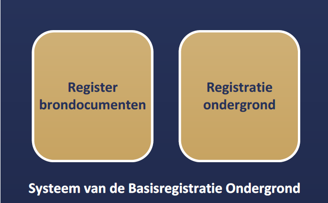

2 Algemene kenmerken en begrippen

2.1 Opzet van de landelijke voorziening

De landelijke voorziening van de BRO is een systeem dat een schakel vormt in een informatieketen. Aan het begin van de keten staan bronhouders die opdracht geven tot de productie van gegevens, of zelf gegevens produceren (artikel 9 van de Wet Bro). De geproduceerde gegevens levert de bronhouder of, namens hem, een dataleverancier  aan de beheerder van de landelijke voorziening van de BRO, de registerbeheerder. De bronhouder is verantwoordelijk voor de levering en de kwaliteit van gegevens. De registerbeheerder registreert de aangeleverde gegevens en levert deze voor (her)gebruik door aan allerlei afnemers.

De opzet van de BRO moet begrepen worden vanuit de verantwoordelijkheden die in de keten zijn belegd. De aangeleverde gegevens vallen onder de verantwoordelijkheid van de bronhouder en de registratiebeheerder mag die gegevens niet veranderen. De registratiebeheerder moet echter wel gegevens toevoegen om de BRO te kunnen beheren en hij kan gegevens toevoegen om de afnemers goed van dienst te kunnen zijn.

Bij wet is geregeld dat de BRO zo wordt opgezet dat er onderscheid bestaat tussen de gegevens die aan de registratiebeheerder zijn aangeleverd en de gegevens die de registratiebeheerder aan de afnemers verstrekt. De BRO valt uiteen in twee grote deelsystemen, het register brondocumenten ondergrond en de registratie ondergrond (Figuur 1).

Een geheel van gegevens dat een bronhouder aanlevert, wordt een brondocument genoemd. De brondocumenten worden in het register brondocumenten ondergrond opgeslagen. De gegevens uit de brondocumenten worden samen met de gegevens die de registratiebeheerder toevoegt in de registratie ondergrond vastgelegd. De registratie ondergrond is het deelsysteem dat gebruikt wordt voor uitgifte.

<figure>
	
	<figcaption>Figuur 1: De twee grote deelsystemen van de landelijke voorziening van de BRO.</figcaption>
</figure>  

Met deze opzet verkrijgt de BRO de nodige flexibiliteit. Zo kan een object in de registratie ondergrond gegevens bevatten die uit meer dan één brondocument afkomstig zijn en bij uitgifte kunnen gegevens van verschillende objecten met elkaar gecombineerd worden. Ook is het mogelijk met het brondocument gegevens op te slaan die alleen voor de bronhouder en de dataleverancier van belang zijn.

De catalogus dekt alle gegevens die opgenomen zijn in de registratie ondergrond. Verreweg de meeste gegevens komen uit de brondocumenten die de dataleverancier levert en een paar gegevens komen voort uit de overdracht van een brondocument aan de registerbeheerder. Aan de aangeleverde gegevens worden enkele gegevens door de registerbeheerder toegevoegd. Als de registerbeheerder een gegeven heeft toegevoegd wordt dat in de beschrijving expliciet vermeld.

Alle gegevens in de registratie ondergrond worden uitgegeven, maar niet alle afnemers krijgen alle gegevens geleverd. De gegevens die niet aan alle afnemers worden uitgeleverd zijn de gegevens die alleen nodig zijn in de communicatie tussen de registratiebeheerder enerzijds en de dataleveranciers en bronhouders anderzijds, of niet openbaar zijn op grond van een wettelijk voorschrift. Zo zijn persoonsgegevens over bronhouder, dataleverancier en onderzoeker/uitvoerder alleen toegankelijk voor de betreffende bronhouder en dataleverancier op grond van de Algemene verordening gegevensbescherming (AVG).

2.2 Registratieobject

Het registratieobject is dé eenheid in de data-architectuur van de BRO. Voor de registratiebeheerder is het de elementaire bouwsteen van de BRO.

Een registratieobject verwijst naar een eenheid van gegevens, een groep entiteiten, die onder de verantwoordelijkheid van één bronhouder valt en die met een bepaald doel is of wordt gemaakt. Het is in directe of indirecte zin gedefinieerd in de ruimte en dat wil zeggen dat een registratieobject een plaats op het aardoppervlak heeft of dat het gekoppeld is aan een ander type registratieobject met een plaats op het aardoppervlak.
De entiteiten zijn niet de entiteiten uit Bijlage I bij de NIS2-richtlijn.

Een registratieobject is niet alleen in de ruimte maar ook in de tijd gedefinieerd. Het leven van een registratieobject begint op het moment dat de gegevens zijn geregistreerd en dat is zo kort mogelijk nadat de gegevens zijn geproduceerd. De levensduur van een registratieobject, en de veranderlijkheid van de gegevens verschilt van object tot object. Een grondwatermonitoringput (GMW) kan tientallen jaren gebruikt worden voor het meten van grondwaterstanden en in de periode kunnen er nieuwe gegevens ontstaan. Dat betekent dat de gegevens van de put in de BRO gedurende zijn hele levensduur bijgewerkt moeten kunnen worden. Aan de andere kant van het spectrum staan de objecten waarvan alle gegevens in een keer worden vastgelegd. Een geotechnisch sondeeronderzoek (CPT) is daar een voorbeeld van. Sondeeronderzoek is eenmalig onderzoek en het resultaat ervan kan al na een of enkele dagen aan de bronhouder worden overhandigd.

2.3 Registratiedomein

Registratieobjecten worden in de BRO gegroepeerd in domeinen. Hoofdstuk 2 van het Besluit Bro onderscheidt zes domeinen:

-bodem- en grondonderzoek

-milieukwaliteit

-grondwatermonitoring

-grondwatergebruik

-mijnbouwwet

-modellen.

De domeinen zijn vanuit het oogpunt van beheer van belang voor de ordening van de inhoud van de BRO. Daarnaast zijn zij nuttig in de communicatie met de partijen die bij de realisatie van de BRO betrokken zijn.
NB: deze registratiedomeinen zijn niet de domeinen als bedoeld in Hoofdstuk 5 van de catalogus. De laatste beschrijven de mogelijke waarden van een attribuut.

2.4 Kwaliteitsregime

In de BRO worden niet alleen gegevens geregistreerd die dateren van na de datum waarop de wet van kracht is geworden. Ook oudere gegevens worden in de BRO opgenomen. Gegevens uit de eerder bestaande systemen Registratie Data en Informatie Nederlandse Ondergrond (DINO) en Bodemkundig Informatie Systeem (BIS) worden zo veel mogelijk naar de BRO overgezet. Verder verplicht artikel 40 van de wet bronhouders digitale, gestructureerde gegevens binnen vijf jaar na inwerkingtreding - van de wetswijziging per 1-7-2025 of van een registratieobject - ter registratie aan te bieden.

Deze historische gegevens kunnen niet altijd voldoen aan de strikte regels die de BRO stelt. Zo kan het voorkomen dat voor gegevens die volgens de strikte regels van de BRO verplicht zijn, geen waarde bekend is. Om de verwerking van de twee categorieën gegevens naast elkaar mogelijk te maken, worden twee kwaliteitsregimes gehanteerd. Voor de levering van gegevens aan de BRO volgens de strikte regels geldt het IMBRO-regime. Bij de levering van historische gegevens wordt geaccepteerd dat een aantal verplichte attributen geen waarde heeft. Voor deze gegevens wordt het IMBRO/A-regime gehanteerd; dat kent minder strikte regels. Als historische gegevens wel aan alle strikte voorwaarden voldoen, worden de gegevens echter onder het IMBRO-regime geleverd.

Artikel 41 van de Wet Bro geeft de bronhouder van een gegeven over een registratieobject dat valt onder de categorie verkenningen, gedurende drie jaar na inwerkingtreding van dit registratieobject, een zekere mate van vrijheid. Als een gegeven voortkomt uit een schriftelijke opdracht van voor inwerkingtreding van dit registratieobject, kan het praktisch blijken het IMBRO/A-regime te hanteren voor gegevens die pas na deze datum zijn geproduceerd.

In schema:

| **Gegeven** | **Omschrijving**  | **Kwaliteitsregime** | **Verplicht voor** | **Verplicht vanaf** | **Transitieperiode** |
| --- | ---|---|---|---|---|
| Nieuwe gegevens | gegevens die dateren van na de datum waarop de ministeriële regeling of een registratieobject van kracht is geworden. | IMBRO | alle bronhouders[^1] (art. 9 Wet Bro) | - Vanaf inwerkingtreding ministeriële regeling of een registratieobject  -	Uitzondering o.b.v. art. 41: verkenning die voortkomt uit een schriftelijke opdracht van voor inwerkingtreding van dit registratieobject, is uitgezonderd van deze verplichting -> en valt daarmee automatisch onder art. 40| - Geen (binnen 20 werkdagen)  - Tot 3 jaar na inwerkingtreding registratieobject  |
| Historische gegevens | gegevens die dateren van **voor** de datum  waarop de ministeriële regeling of een registratieobject van kracht is geworden. | IMBRO/A   (IMBRO als gegevens voldoen aan IMBRO)| - DINO en BIS (art. 39).    - Andere actuele digitale, gestructureerde gegevens bij bronhouders van vóór 1-7-2025 ([art.  40](https://zoek.officielebekendmakingen.nl/dossier/kst-36544-2.html)).| - Een bij koninklijk besluit te bepalen tijdstip (art. 39).   - [Vanaf  1-7-2025](https://zoek.officielebekendmakingen.nl/stb-2025-97.html) of vanaf inwerkingtreding van een registratieobject dat later in werking treedt. | - Binnen vijf jaar |

De periode waarin de bronhouders die vrijheid hebben wordt de transitieperiode genoemd. Na afloop van de transitieperiode kan alleen onder het strikte IMBRO-regime worden aangeleverd.

Voor een nadere toelichting van het kwaliteitsregime met een beschrijving van verschillende scenario's voor het corrigeren van het kwaliteitsregime van aangeleverde gegevens, zie Handreiking aanleveren BRO-gegevens op de BRO Productomgeving.

2.5 Formele en materiële geschiedenis

De BRO maakt deel uit van een stelsel van basisregistraties. Binnen het stelsel maakt men onderscheid tussen de materiële geschiedenis en de formele geschiedenis van een object.

Het begrip materiële geschiedenis wordt gebruikt om de veranderingen van eigenschappen van een object in de werkelijkheid aan te duiden (dus niet attributen in een systeem). De materiële geschiedenis van een object wordt, voor zover relevant, in de BRO vastgelegd. Niet alle registratieobjecten hebben een materiële geschiedenis, alleen de objecten met een levensduur, zoals de grondwatermonitoringput.

Het begrip formele geschiedenis wordt gebruikt voor de veranderingen van attributen van een object in de registratie zelf. De meeste van die veranderingen gaan terug op een verandering van eigenschappen in de werkelijkheid, en de formele geschiedenis geeft aan wanneer de veranderingen in de BRO geregistreerd zijn. De formele geschiedenis kent ook gebeurtenissen die niet het gevolg zijn van een verandering in de werkelijke eigenschappen van een object. Die gebeurtenissen hebben betrekking op correcties. Het kan gebeuren dat een bronhouder erachter komt dat er een onjuiste waarde was geregistreerd en dan zorgt hij ervoor dat die verbeterd wordt. De registratie van de verbetering is een formele gebeurtenis.

Alle registratieobjecten hebben een formele geschiedenis en die wordt in de BRO globaal vastgelegd in de registratiegeschiedenis van het object. Globaal wil zeggen dat de BRO alleen een overzicht van de formele geschiedenis geeft. Voor de details moet het register brondocumenten ondergrond worden geraadpleegd.

Bij een correctie wordt het betreffende gegeven in de BRO overschreven en is de oude waarde van het gegeven niet meer direct beschikbaar voor de afnemers. Zou een afnemer toch willen weten wat de eerdere foute waarde was, dan moet hij het register brondocumenten ondergrond raadplegen.

2.6 Coördinaten en referentiestelsels

De objecten van de BRO zijn gedefinieerd in de ruimte en dat wil zeggen dat een object zelf een plaats op het aardoppervlak, een locatie, heeft, of dat het gekoppeld is aan een ander type registratieobject met een locatie. Afhankelijk van het type registratieobject, wordt de locatie van het object geregistreerd als een punt, een lijn of een vlak.

De locatie is de horizontale positie van een object. Voor bepaalde objecten is het voldoende dat alleen die horizontale positie wordt vastgelegd, maar voor veel objecten is ook de verticale positie van belang.

Posities worden vastgelegd in coördinaten en die zijn gedefinieerd in een bepaald referentiestelsel.

Er zijn verschillende typen referentiestelsels. Zo spreekt men van horizontale referentiestelsels (2D), verticale referentiestelsels (1D), gecombineerde referentiestelsels (2D, 1D) en werkelijke 3D referentiestelsels. In Nederland worden de horizontale en de verticale component van een positie in een afzonderlijk stelsel uitgedrukt. Het is vandaag de dag mogelijk met gps een positie in een 3D-referentiestelsel vast te leggen, maar de wens over te stappen op het gebruik van 3D is nog door geen van de partijen die betrokken zijn bij de BRO naar voren gebracht.

2.6.1 Referentiestelsels voor de horizontale positie

In Nederland zijn traditioneel verschillende referentiestelsels voor de horizontale positie in gebruik. In 2009, bij de eerste voorbereidingen voor de totstandkoming van de BRO, is al vastgesteld dat de verscheidenheid aan referentiestelsels de BRO voor problemen stelt omdat de registratie dan niet gemakkelijk op een eenduidige manier bevraagd kan worden. In de BRO worden namelijk zowel gegevens met een locatie op land als gegevens met een locatie op zee geregistreerd. In de toenmalige praktijk werden op land en op zee verschillende stelsels gebruikt. Op land werd RD gebruikt en op zee waren verschillende stelsels in gebruik, waarvan WGS84 de belangrijkste was.

In 2009 was ook al bekend dat de Europese Richtlijn (nr. 2007/2/EG van het Europees Parlement en de Raad van de Europese Unie van 14 maart 2007 tot oprichting van een infrastructuur voor ruimtelijke informatie in de Gemeenschap zoals gewijzigd in 2019 en 2024, PbEU 2024 L 2829) Inspire, de lidstaten vraagt de gegevens in Europa in één referentiestelsel uit te gaan wisselen, te weten in ETRS89. Daarom is het besluit genomen de BRO zo in te richten, dat de registratie bevraagd gaat worden in ETRS89.

Het besluit wordt ondersteund door ontwikkelingen in Nederland. Sinds 2013 wordt er door de drie belangrijkste autoriteiten in Nederland op het gebied van referentiestelsels, het Kadaster, de Dienst der Hydrografie en Rijkswaterstaat, gewerkt aan de totstandkoming van nieuwe afspraken. Die afspraken moeten in lijn zijn met Europese afspraken en leiden tot heldere en eenduidige transformatieprocedures tussen referentiestelsels. Concreet betekent dit dat in Nederland op termijn het ETRS89-stelsel als standaard zal worden gehanteerd voor het uitwisselen van geo-informatie.

Het besluit betekent niet dat de gegevens ook in ETRS89 aangeleverd moeten worden. De BRO voorziet een periode van transitie waarin de aanleverende partijen zelf bepalen wanneer zij overstappen op ETRS89. Die periode zal naar verwachting jaren duren. Om de transitie te ondersteunen hanteert de BRO de volgende spelregels:

Gegevens mogen in een beperkt aantal referentiestelsels worden aangeleverd (RD, WGS84 en ETRS89).

Voor locaties op land wordt alleen RD of ETRS89 toegestaan.
(WGS84 is niet geschikt voor nauwkeurige toepassingen, bij wijze van uitzondering wordt binnen het domein milieukwaliteit WGS84 op land toegestaan.)

Voor locaties op zee wordt alleen WGS84 of ETRS89 toegestaan.
De aangeleverde coördinaten worden in de registratie opgeslagen.

De aangeleverde coördinaten worden door de BRO getransformeerd naar het ETRS89 referentiestelsel.

De getransformeerde coördinaten worden naast de aangeleverde coördinaten opgeslagen.

Bij de getransformeerde coördinaten wordt ook een identificatie van de gebruikte transformatiemethode opgeslagen.

Als de coördinaten in ETRS89 zijn aangeleverd, dan staat bij aangeleverde en getransformeerde positie dezelfde informatie. Voor de locatie worden de getransformeerde coördinaten en de aangeleverde coördinaten beide aan de afnemers verstrekt.

2.6.2 Referentiestelsels voor de verticale positie

In Nederland zijn voor verticale posities op land en zee verschillende referentiestelsels in gebruik. Op land wordt NAP gebruikt. Op zee is het in de voor de BRO relevante werkvelden gebruikelijk posities uit te drukken t.o.v. het gemiddeld zeeniveau (MSL, Mean Sea Level), maar posities t.o.v. LAT komen ook voor (Lowest Astronomical Tide). Dit laatstgenoemde stelsel wordt in de richtlijn Inspire genoemd als het stelsel van voorkeur voor het uitdrukken van verticale posities op zee. De BRO staat daarom op zee het gebruik van LAT naast MSL toe. Aangeleverde verticale posities worden door de BRO niet getransformeerd.

2.7 Gegevens op land en op zee

De BRO bevat gegevens over de ondergrond van Nederland en zijn zgn. Exclusieve Economische Zone (EEZ). De EEZ is het gebied op de Noordzee waar Nederland economische rechten heeft. Voor de referentiestelsels die bij levering aan de BRO worden toegestaan, is het van belang te weten of de locatie van een object op zee of op land ligt.

Als scheidingslijn tussen land en zee wordt in de BRO de UNCLOS-basislijn gehanteerd. Het beheer van deze basislijn valt onder de verantwoordelijkheid van de Dienst der Hydrografie van het ministerie van Defensie. Deze dienst voert die taak uit op basis van het Zeerechtverdrag van de Verenigde Naties uit 1982, dat in het Engels de United Nations Convention on the Law of the Sea (UNCLOS) heet. De basislijn is opgebouwd uit de nulmeterdieptelijn zoals weergegeven op de zeekaarten en enkele rechte basislijnen die onder meer de monding van de Westerschelde en de wateren tussen de Waddeneilanden afsluiten.

De grens tussen land en zee is veranderlijk. De Dienst der Hydrografie stelt de grens opnieuw vast wanneer daartoe voldoende aanleiding is. De BRO hanteert bij inname de meest recente versie van de UNCLOS-basislijn en controleert daarmee of de juiste referentiestelsels gebruikt worden.

Tussen het moment waarop de locatie van een object wordt bepaald en het moment waarop het gegeven in de BRO wordt vastgelegd verloopt enige tijd. In die periode kan de positie van de UNCLOS-basislijn opnieuw zijn vastgesteld, en dan ontstaat er een discrepantie die bij het leveren van gegevens aan de BRO tot problemen kan leiden. Wanneer een dergelijk probleem zich voordoet, wordt de dataleverancier gevraagd contact op te nemen met de registerbeheerder om gezamenlijk tot een oplossing te komen.

Een soortgelijk probleem doet zich voor met betrekking tot de begrenzing van Nederland, met name van het Nederlands territoir. De grenzen van Nederland worden ieder jaar op 1 januari vastgesteld door het Kadaster en vastgelegd in de basisregistratie kadaster. De registerbeheerder controleert bij inname of een object in het gebied ligt dat Nederland en zijn Exclusieve Economische Zone omvat, en hanteert daarbij de actuele grenzen. Ook bij problemen die te herleiden zijn tot een verandering in de begrenzing van Nederland, wordt de dataleverancier gevraagd contact op te nemen met de registerbeheerder om gezamenlijk tot een oplossing te komen.

Binnen het domein Mijnbouwwet wordt de scheidingslijn tussen land en zee niet bepaald door de UNCLOS-basislijn, maar door een over zee lopende lijn die is vastgelegd in een bijlage bij de Mijnbouwwet. In de BRO wordt deze lijn aangeduid als mijnbouwgrens. Voor de referentiestelsels die bij levering aan de BRO worden toegestaan, is het binnen het domein Mijnbouwwet van belang te weten of de locatie van een object aan landzijde of aan zeezijde van de mijnbouwgrens ligt. Waar in voorgaande paragrafen 'op land' en 'op zee' is genoemd, houdt dat binnen het domein Mijnbouwwet in: aan landzijde respectievelijk aan zeezijde van de mijnbouwgrens.

Ook registratieobjecten die (ten dele) in het buitenland liggen, kunnen van belang zijn voor het inzicht over de ondergrond in Nederland. Zo wordt bij het hydrologisch beheer van het Nederlands grondgebied soms gebruik gemaakt van grondwatermonitoringnetten, waarvan de bijbehorende grondwatermonitoringputten zowel in Nederland, als in het buitenland liggen. Ook kan het voorkomen dat een mijnstelsel gedeeltelijk in het buitenland ligt, in welk geval de toegang(en) tot dit mijnstelsel in het buitenland kunnen liggen. In dit soort situaties dient de begrenzing van Nederland geen beperking te zijn voor het kunnen registreren van de betreffende ondergrond gegevens. Deze objecten moeten "vanzelfsprekend" wel een Nederlandse bronhouder hebben. Indien van toepassing is in de gegevensdefinitie voorzien dat onder bepaalde condities ook gegevens geregistreerd kunnen worden die (ten dele) in het buitenland liggen.

2.8 Nauwkeurigheid van meetwaarden

Voor zinvol gebruik van attributen met een gemeten, berekende of anderszins bepaalde waarde is het noodzakelijk dat de nauwkeurigheid van die waarde bekend is.

Het begrip nauwkeurigheid laat zich in deze context het best omschrijven als de juistheid van een gemeten of berekende waarde. In de meeste processen waarin de waarde van een gegeven wordt bepaald, kan de afwijking van de daadwerkelijke waarde slechts via een kalibratie- of statistisch proces worden verkregen. Het resultaat omvat dan niet alleen een van de mogelijke realisaties van een meetwaarde maar ook informatie over de mogelijke spreiding van de meetwaarden.

De BRO gaat ervan uit dat de producenten van gegevens de metingen en berekeningen uitvoeren binnen een stelsel van afspraken binnen het desbetreffende werkveld. Uitgangspunt is dat ook de eisen waaraan de gegevens op het gebied van nauwkeurigheid moeten voldoen in afspraken zijn vastgelegd. Dat kunnen praktische werkafspraken zijn, maar ook afspraken die vertaald zijn naar ISO- en NEN-normen. In de catalogus wordt in beginsel verwezen naar die normen. Waar deze normen niet voorzien in afspraken over de nauwkeurigheid, stelt de BRO hieraan specifieke eisen. Deze zijn dan vermeld in de catalogus.

2.9 Authentiek gegeven

In de wet is een aantal gegevens expliciet als authentiek aangeduid. Dit wordt in de catalogus nader uitgewerkt; verreweg de meeste gegevens zijn authentiek.

Met de aanduiding authentiek wordt, zoals geformuleerd in de memorie van toelichting op de wet, tot uitdrukking gebracht dat:

a. Het gegeven in samenhang met andere gegevens door een groot aantal bestuursorganen in verschillende processen wordt gebruikt en derhalve bestemd is voor gegevensuitwisseling tussen bestuursorganen;

b. de verantwoordelijkheid voor betrouwbaarheid van het gegeven eenduidig geregeld is;

c. het gegeven onderworpen is aan intern en extern kwaliteitsonderzoek, en

d. het gegeven zich leent voor verplicht gebruik door bestuursorganen en eenmalige verstrekking door burgers en bedrijven aan de overheid.

In de praktijk mag een gebruiker van de gegevens ervan uitgaan dat alle gegevens correct zijn. De catalogus moet de gebruiker alle informatie geven die voor een goed begrip daarvan nodig is. Heeft een gebruiker echter gerede twijfel over de juistheid van een authentiek gegeven dan wordt verwacht dat hij de registerbeheerder daarvan op de hoogte brengt. Bronhouders zijn, bij gerede twijfel over de juistheid van een authentiek gegeven (of het ontbreken ervan), zelfs verplicht daarvan melding te maken (artikel 30 van de Wet Bro).

Voor alle gegevens is aangegeven of ze authentiek zijn. Ook is voor alle gegevens aangegeven of ze aanwezig moeten zijn en een waarde moeten hebben. Dat is van belang bij het bepalen of de registratie volledig is. Er kunnen dus ook gegevens zijn die authentiek zijn, maar geen waarde hoeven te hebben. Juist omdat er verplichtingen gelden t.a.v. authentieke gegevens, vraagt dit om een korte toelichting. Wanneer een authentiek gegeven geen waarde heeft, moet de gebruiker ervan uitgaan dat het gegeven niet is geproduceerd. Dat geval kan zich uiteraard alleen voordoen wanneer er vrijheid van beslissen bestaat bij de bronhouder of de producent. Voor de duidelijkheid, als er wel een waarde is dan moet die ook in de BRO worden opgenomen. Bij gerede twijfel over het ontbreken van een waarde, moet een bestuursorgaan dat melden.
